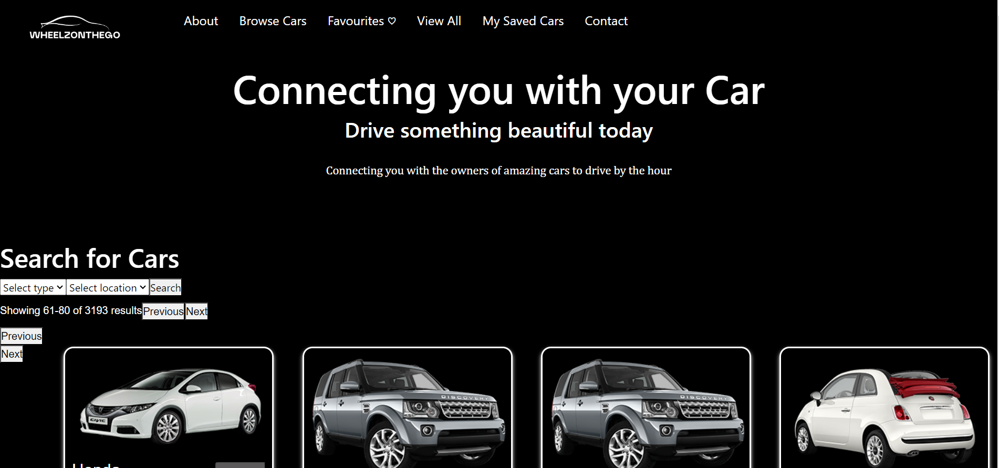

# WheelzOnTheGo
A Car Sharing App

## Description 

This car sharing app known as [WheelzOnTheGo](Deployed link to be here) is designed to provide exceptional car rental services that cater to a wide range of needs, preferences, and destinations.

       
##  Features

- Browse super cars in your city and rent by the hour 

## Instalation 

No installation required. The Web page can be viewed using modern web browser such as Microsoft Edge, Firefox, chrome amongst other browser.

## Usage &  Animation 

The animation below demonstrates the application functionality:

## ScreenShot

The following images shows the web application's appearance and functionality:

## Libraries Integration 

Bootsrap: Boostrap is used 

JSON file Library package 

## Contributing 

Contributions are welcome! Don't hesitate to chip in your ideas, file bug report or provide suggestion on improvement. Kindly open an issue or submit a pull request. 

## License

This project is licensed under the [MIT License](LICENSE).

## Credit 

This project has been collaboratively made by:

[mandyjmiller](https://github.com/mandyjmiller)

[esther-adeola](https://github.com/esther-adeola)

[HarunaTech](https://github.com/HarunaTech)

[Costea47](https://github.com/Costea47)

[Ifeoma101](https://github.com/ifeoma101)

## Live site Access

Please click to see the deployed live site [WheelzOnTheGo](Deployed link to be here)
