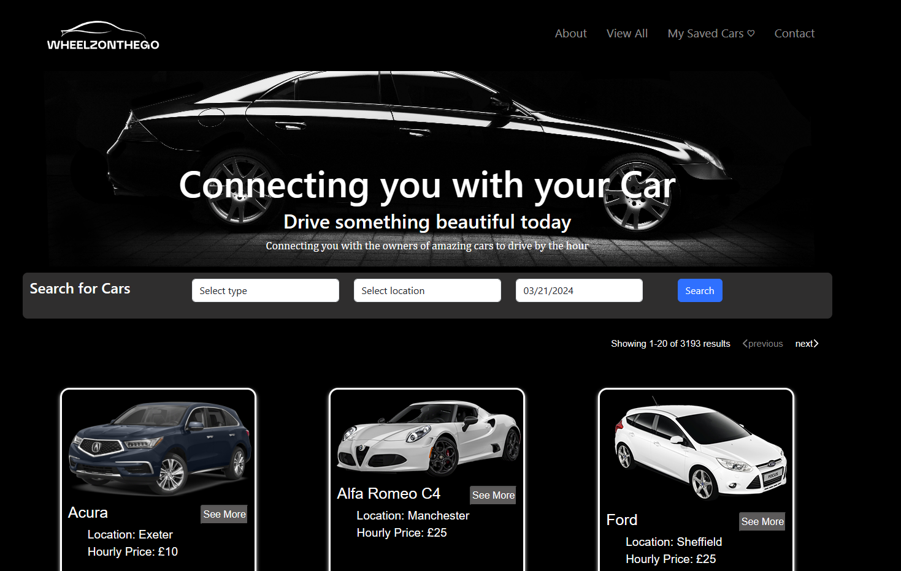
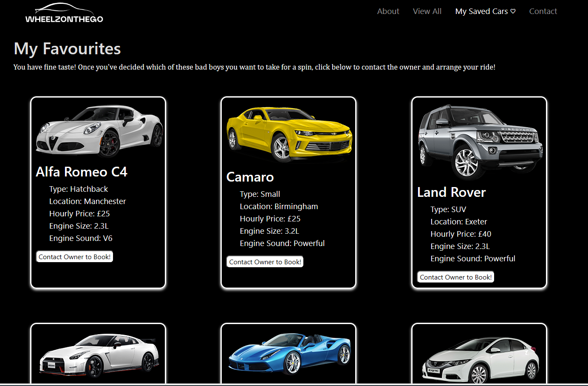
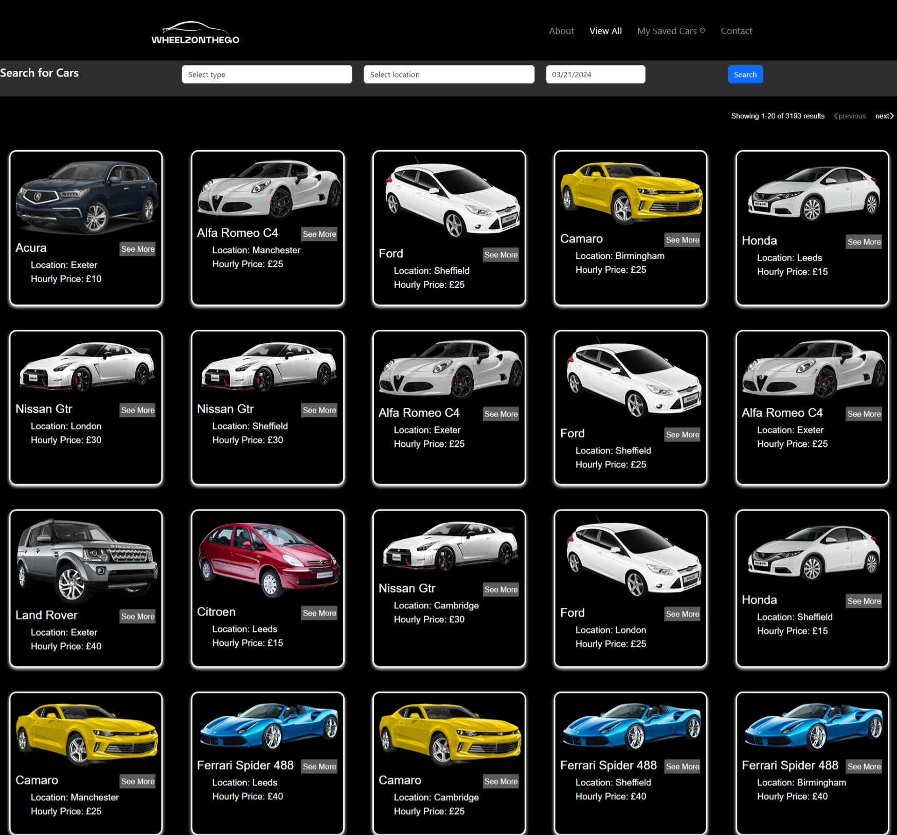
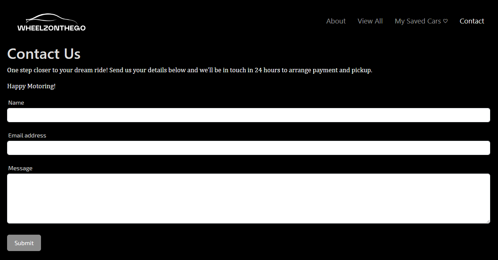
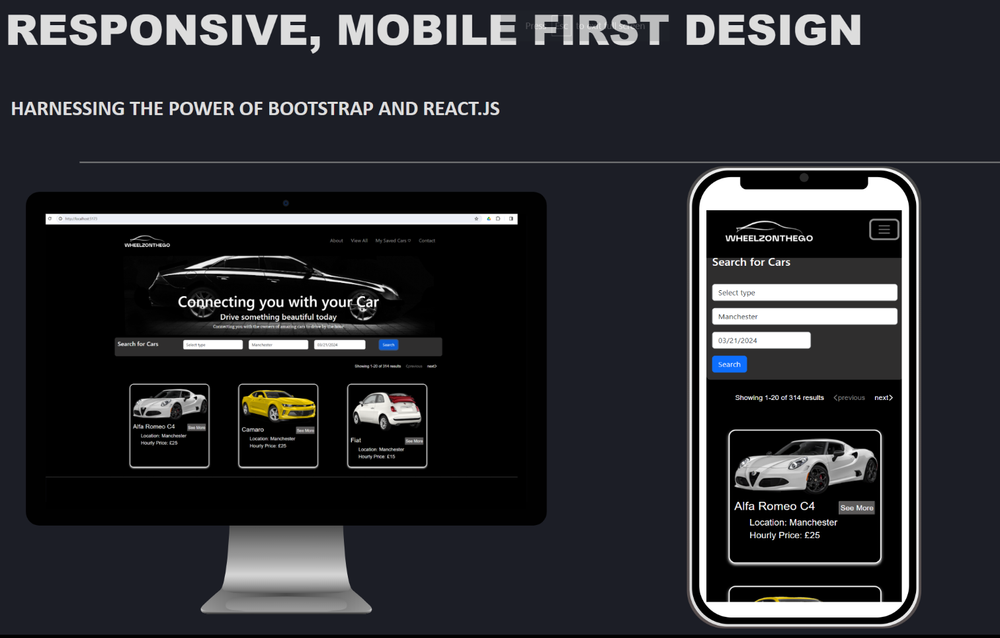

# WheelzOnTheGo
A Car Sharing App

## Description 

This car sharing app known as [WheelzOnTheGo](https://wheelzonthego.netlify.app/) is designed to provide exceptional car rental services that cater to a wide range of needs, preferences, and destinations.

      
##  Features

- Browse super cars in your city and rent by the hour 

## Instalation 

As a website user, there are no installation requirements. The Web page can be viewed using modern web browser such as Microsoft Edge, Firefox, chrome amongst other browser.

As a developer, there are some additional installation steps:

generate a starter React app using Vite. You can do this by running `npm create vite@latest wheelz -- --template react`. .

* Once you have a `wheelz ` React app generated, cd into your application's directory and run `npm install` to install the base dependencies.

* Once everything has been installed, delete the `src` folder inside of your starter app and replace it with the [src] provided with this project

* Start the app by running `npm run dev` in your terminal and then take a moment to study the HTML code being rendered in the browser at [http://localhost:5173](http://localhost:5173).

Ensure Bootstrap and other paackages are installed using the following:

* npm i --save bootstrap @popperjs/core

* npm install --save react-fontawesome

* npm install react-datepicker --save

* npm install react-datepicker --save

## ScreenShot

The following images shows the web application's appearance and functionality:

## Libraries Integration 

- Bootstrap
- Material Ui
- ReactSlick
- FontAwsome
- ReactAwsomeButton
- ReactDatePicker

## Contributing 

Contributions are welcome! Don't hesitate to chip in your ideas, file bug report or provide suggestion on improvement. Kindly open an issue or submit a pull request. 

## License

This project is licensed under the [MIT License](LICENSE).

## Credit 

This project has been collaboratively made by:

[mandyjmiller](https://github.com/mandyjmiller)

[esther-adeola](https://github.com/esther-adeola)

[HarunaTech](https://github.com/HarunaTech)

[Costea47](https://github.com/Costea47)

[Ifeoma101](https://github.com/ifeoma101)

## Live site Access

Please click to see the deployed live site [WheelzOnTheGo](https://wheelzonthego.netlify.app/)
